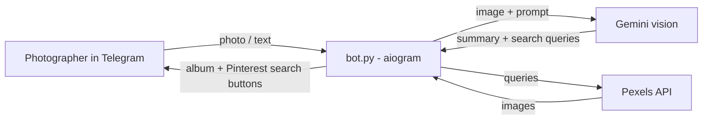

## 📷 ShotScout

A Telegram bot that helps photographers find reference images for their shoots. Send a photo or describe the shot you have in mind, and ShotScout analyses the look (pose, composition, lighting, palette, setting, mood), then replies with similar reference images and ready-made Pinterest searches.

Telegram bot: **@ShotScout_Bot** (available while the bot instance is running)

## Features

- **Photo or text input:** upload a reference photo (optionally with a caption) or write a description in any language.
- **AI look analysis:** a Gemini vision model turns your input into a short summary and 3–5 targeted search queries (pose, lighting, location, mood).
- **Reference album:** up to 8 matching images from Pexels, sent as a Telegram album with photographer credits.
- **Pinterest search buttons:** one tap opens each generated query on Pinterest.

## How it works



### Why Pinterest links and not Pinterest pins?

Pinterest's public API does not offer pin search to regular apps (the search endpoint is limited to approved partners), and scraping Pinterest violates its terms. So ShotScout returns real images from Pexels and links to the equivalent Pinterest search pages instead.

## Requirements

- Python 3.10+
- A Telegram bot token from [@BotFather](https://t.me/BotFather)
- A Gemini API key from [Google AI Studio](https://aistudio.google.com/)
- A Pexels API key from [pexels.com/api](https://www.pexels.com/api/)

## Setup

1. Clone the repository and install the dependencies:

   ```bash
   git clone https://github.com/<your-username>/<your-repo>.git
   cd <your-repo>
   pip install "aiogram>=3.13" httpx google-genai
   ```

2. Set the environment variables.

   **Windows (PowerShell):**

   ```powershell
   $env:TELEGRAM_TOKEN="your-telegram-token"
   $env:GEMINI_API_KEY="your-gemini-key"
   $env:PEXELS_API_KEY="your-pexels-key"
   ```

   **macOS / Linux:**

   ```bash
   export TELEGRAM_TOKEN="your-telegram-token"
   export GEMINI_API_KEY="your-gemini-key"
   export PEXELS_API_KEY="your-pexels-key"
   ```

3. Run the bot:

   ```bash
   python bot.py
   ```

   You should see `Start polling` in the terminal. Open your bot in Telegram, press **Start**, and send a photo or a description.

## Configuration

| Variable | Required | Description |
| --- | --- | --- |
| `TELEGRAM_TOKEN` | yes | Bot token from @BotFather |
| `GEMINI_API_KEY` | yes | API key from Google AI Studio |
| `PEXELS_API_KEY` | yes | API key from Pexels |
| `GEMINI_MODEL` | no | Gemini model name (default: `gemini-3.6-flash`). Google retires and renames models often, so if you get a `404 NOT_FOUND` error, set a model that is currently available in AI Studio. |

> **Never commit your tokens or keys.** Keep them in environment variables or in a `.env` file that is listed in `.gitignore`. If a token is ever exposed, revoke it in @BotFather (`/mybots` → your bot → **API Token** → **Revoke current token**)

## Limitations

- **Free-tier limits:** the Gemini free tier is rate limited and can return `429` or `503` errors during busy periods. Model availability on the free tier also changes over time.
- **Pexels limits:** the Pexels API allows 200 requests per hour and 20,000 per month by default. Each user message triggers 3–5 Pexels requests.
- **Privacy:** on Google's free tier, inputs may be used to improve Google's models. Consider this before sending client photos, or use a paid tier or a local model.
- **Similarity is semantic:** results are matched by generated keywords, not by pixel-level visual similarity.


## Credits

- Photos provided by [Pexels](https://www.pexels.com). Photographer credits are shown on every image.
- Built with [aiogram](https://docs.aiogram.dev/), [httpx](https://www.python-httpx.org/) and the [Google Gen AI SDK](https://github.com/googleapis/python-genai).
